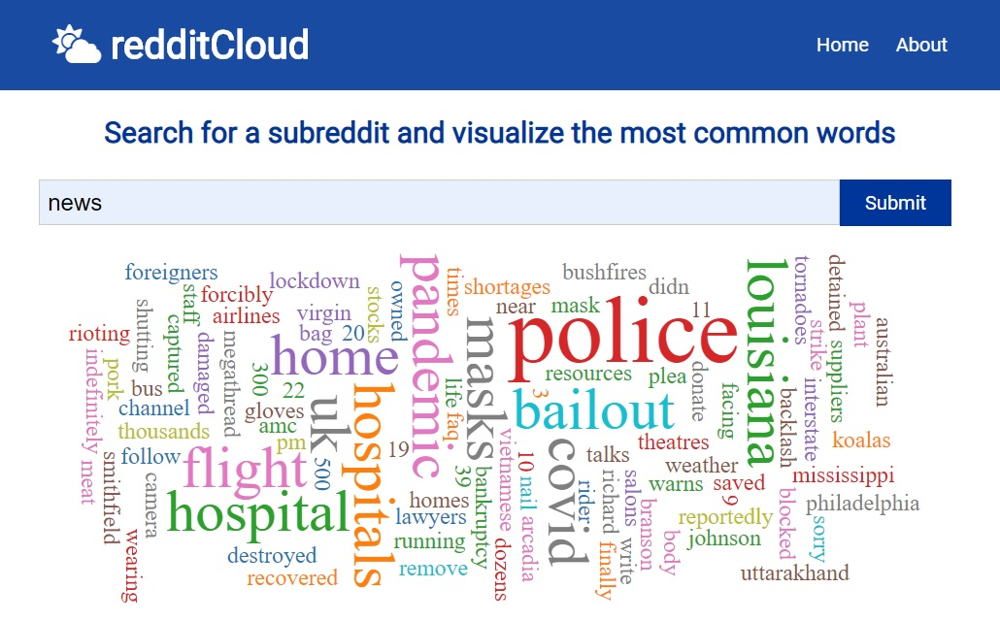

# redditCloud

Search for a subreddit and visualize the most common words



## Setup

To clone and run this application, you'll need [Git](https://git-scm.com/). From your command line:

```sh
# Clone this repository
$ git clone https://github.com/andyrutherford/reddit-cloud.git

# Go into the repository
$ cd reddit-cloud

# Install dependencies
$ npm install

# Run the app
$ npm start
```

## Tech

redditCloud uses a number of open source projects to work properly:

- [ReactJS](https://reactjs.org/) - A JavaScript library for building user interfaces
- [axios](https://github.com/axios/axios) - Promise based HTTP client for the browser and node.js
- [react-wordcloud](https://www.npmjs.com/package/react-wordcloud) - Simple React + D3 wordcloud component with powerful features.
- [reddit API](https://www.reddit.com/dev/api/)

## Demo

Here is a working live demo : https://reddit-cloud.netlify.com/

## License

MIT
